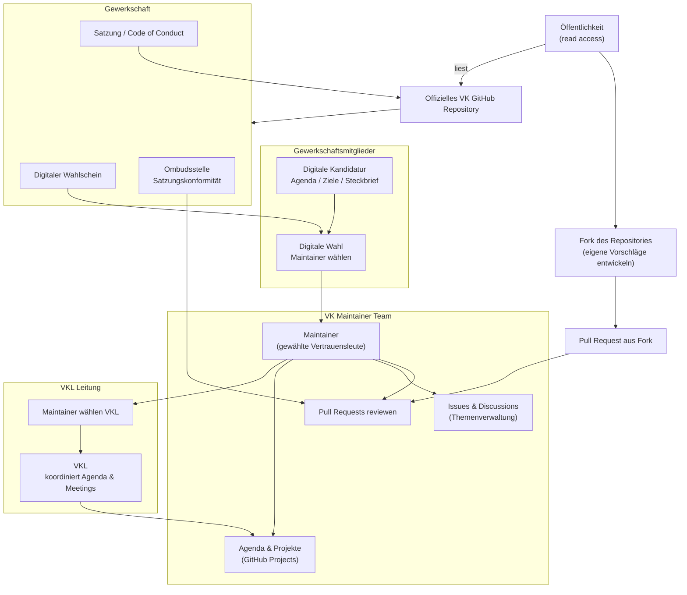

# Organisation
Ich habe festgestellt, dass sich demokratische Strukturen sehr gut in GitHub abbilden lassen.
Die unteren Grafiken zeigen, wie sich das Zusammenspiel aus Gewerkschaft, Mitgliedern und Öffentlichkeit in einem OpenSource Projekt abbilden lassen. Natürlich wäre es sinnvoll, hier weitere Unterprojekte anzulegen, die gleichen Mechanismen folgen, sodass es thematische GitHub-Projekte gibt. CyberVK könnte Templates bereitstellen, wenn Projekte im CyberVK beschlossen, und Arbeitsgruppen festgelegt sind. So können Verantwortliche in ihrem Projekt frei agieren und sind trotzdem der Satzung verpflichtet. Wer nicht warten möchte, kann natürlich immer forken und diee Bürokratie wird später erledigt, oder gar nicht. So gibt es lose und innergewerkschaftliche Zusammenarbeit, die nicht ausbremst, jedem alle Freiheiten gewährt, aber den Konsens im CyberVK trotzdem vereinen kann.




# Pull-Request
```mermaid
flowchart LR

  IDEA["Idee / Thema"]

  PUBLIC["Öffentlichkeit"]
  MEMBER["Mitglied"]

  FORK["Fork des Repositories"]

  ISSUE["Issue<br/>Themenvorschlag"]

  DISC["Discussion<br/>Debatte"]

  PR["Pull Request"]

  CHECK["Automatische Checks<br/>Commit Signing<br/>Satzung / CoC"]

  REVIEW["VK Review<br/>(Maintainer)"]

  DECISION{"VK Entscheidung"}

  MERGE["Merge<br/>Beschluss"]

  CHANGE["Überarbeitung"]

  CLOSE["Closed"]

  RELEASE["Release / Protokoll"]

  UNION["Rückkopplung<br/>Gewerkschaft"]

  IDEA --> PUBLIC
  IDEA --> MEMBER

  PUBLIC --> FORK
  FORK --> PR

  MEMBER --> ISSUE
  ISSUE --> DISC
  DISC --> PR

  PR --> CHECK
  CHECK --> REVIEW

  REVIEW --> DECISION

  DECISION -->|angenommen| MERGE
  DECISION -->|Überarbeiten| CHANGE
  DECISION -->|abgelehnt| CLOSE

  CHANGE --> PR

  MERGE --> RELEASE
  RELEASE --> UNION
``
