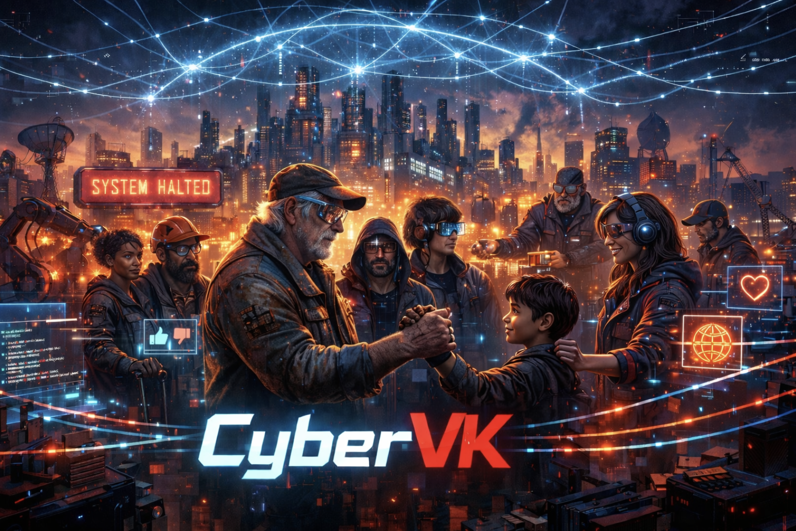

# Moin
#### Was ist das hier?
Das weiß ich auch noch nicht genau. Ich habe in der Schlange beim Arbeitsamt [angefangen zu schreiben](blog).
Ich denke, es entwickelt sich so vor sich hin, ich verfeinere immer ein bisschen.
#### [Lizenz](LICENSE)

## Erfolgreiche, faire, gerechte Digitalisierung durch Mitbestimmung
Ich denke, es entwickelt sich gerade zu einer praktischen Umsetzung dessen, was ich als Vertrauensmann meiner Gewerkschaft an meiner alten Uni vorstellen durfte: eine wissenschaftlich argumentierte Herleitung, warum betriebliche Mitbestimmungsmechanismen die Grundlage einer erfolgreichen Digitalisierung in Deutschland sind, und wie man das Umsetzen kann:
#### [Strategie Digitalisierung](Digitalisierung.md)

Irgendwie entwickelt sich das gerade in ein konkretes Projekt, das praktisch zeigt, was ich da so hochtrabend ausgearbeitet habe:
#### [Ideensammlung](TODO.md)

Ich schreibe immer ein bisschen weiter am Blog, und sammel nebenbei meine Ideen. Damit können wir:
- Gewerkschaft digitalisieren
- zivilgesellschaftliche Organisationen zusammenbringen
- Leuten die komplizierten Konzepte von [Gewerkschaftsarbeit nahebringen](blog) und direkt [praktisch loslegen](https://github.com/mattih11/union/blob/main/TODO.md#wir-gehen-mit-gutem-beispiel-voran)
- Gewerkschaften die komplizierten Konzepte von [Digitalisierung nahebringen und direkt praktisch loslegen](https://github.com/mattih11/union/blob/main/TODO.md#github-fuer-referenzimplementierungen)
- OpenSource schaffen, die
  - Digitalisierung einfach macht
  - faire Arbeit ermöglicht
  - kleinen Unternehmen und FreiberuflerInnen hilft.
  - Das Tariftreuegesetz stärkt, USPs für tarifgebundene IT-Dienstleistungen schafft und Einstiegshürden nimmt.
  - Der Verwaltung hilft
  - Unterstützung und Solidaritaet einfach macht
- Menschen, die keine Arbeit haben, helfen.
- Menschen, die unzufrieden sind, zeigen wo Hilfe ist, und was man tun kann.

**Und damit hoffentlich unserer eigentlich schoenen Demokratie ein bisschen helfen!**

Alles ist [CreativeCommons](LICENSE). Wenn was nicht stimmt, oder jemand mitmachen möchte: [Das Repo ist auf](https://github.com/mattih11/union/pulls).
Ich möchte später aber [klare Entscheidungsprozesse abbilden](ORGANISATION.md), die mit gewerkschaftlichen Mechanismen kompatibel sind.
Eventuell könnte man Mitglieder zu Maintainern machen, und Nichtmitglieder dürfen aber natürlich ueber Forks Mitarbeiten.
**Das wäre dann quasi ein digitaler Vertrauenskörper.**
Wer nicht weiß, was das ist: [Die Wikipedia](https://de.wikipedia.org/wiki/Vertrauensperson_(Gewerkschaft))

**Vielleicht schaffen wir hier ein Beispiel, wie man Solidarität digitalisiert!**
